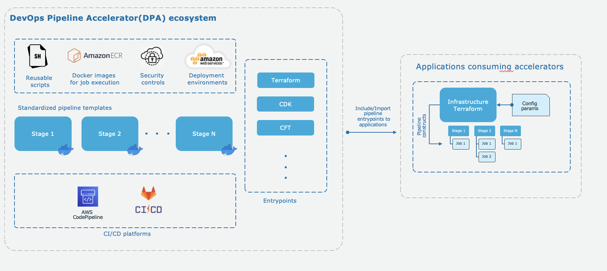

# DevOps Pipeline Accelerator (DPA)

This repository contains the code and resources on how to build centralised templates for your infrastructure deployment pipeline, for various types of Infrastructure as a Code Tools. These templates can be consumed by various teams to orchestrate their Infrastructure build and deployment pipelines with the standard/basic required configurations. 
This will help the teams to focus more on developing features than working on building pipelines for the deployment.

DPA Solution is basically build around 3 pillars - Entrypoints, Aggregators and Stages.
1. Entrypoint is the Configuration file which you can use to Customize the Default Pipeline as per the requirements of each Appplication. This is the file which resides in your Application Repository. All other files/configurations explained further in this Solution would reside in the Common Repository or Pipeline Repository.

## Table of content
- [DevOps Pipeline Accelerator (DPA)](#devops-pipeline-accelerator-dpa)
  - [Table of content](#table-of-content)
  - [Principles](#principles)
    - [Entrypoints](#entrypoints)
    - [Aggregators](#aggregators)
    - [Stages](#stages)
  - [Prerequisites](#prerequisites)
  - [Architecture](#architecture)
  - [Deployment](#deployment)
  - [Benefits](#benefits)
  - [Limitations](#limitations)
  - [Backlog](#backlog)
  - [Access Management](#access-management)
  - [Examples](#examples)
  - [Contributing](#contributing)
  - [License](#license)
  - [Contributors](#contributors)

## Principles
1. Deployments to environments must be consistent and use same artifacts for deployment
2. Each job in pipeline should run in specific Docker containers
3. DPA has been designed to work with feature branch based branching model

DPA contains below few important modules in code :

### Entrypoints
Entrypoints in DPA represets specific IaC pipeline strating point that will be consumed by application. Entrypoint consists of aggregators and various stages.
This is the Configuration file which you need to add in your Application Repository and used for Customizing the various pre-defined stages.

***Example Entrypoint files :***
1. https://github.com/aws-samples/aws-devops-pipeline-accelerator/blob/main/examples/aws_codepipeline/terraform/entrypoint/terraform-infrastructure.json
2. https://github.com/aws-samples/aws-devops-pipeline-accelerator/blob/main/gitlab-ci/entrypoints/terraform-infrastructure.yml

### Aggregators
Aggregators in DPA is a collection of jobs managed by stages, there are multiple wrappers that forms entrypoint for specific IaC pipeline.

### Stages
Stages contain actual building blocks that form the jobs inside stages. Each stage represent specific execution of pipeline jobs.
***Default Stages provisioned for a Single Environment (dev) are mentioned below***. You can customize the pre-defined stages in the Entrypoint configuration provided above. And this is explained in detail in the Deployment Section for individual types of Deployment [below](#deployment)

The pipeline stops/exits on encountering a failure at any of the below stages. Then the user has to fix these failures and re-run the Pipeline to proceed.

1. Init
2. Build
3. Test
4. PreDeploy, Package, Publish
5. Deploy
6. Verify
7. Manual Approval
8. Destroy

## Prerequisites 

1. An AWS Account with necessary permissions/roles that will be used to provision resources using IaC templates
2. Docker Image created and pushed to ECR as [outlined here](https://github.com/aws-samples/aws-devops-pipeline-accelerator/blob/main/shared-docker/docker-images/README.md)

## Architecture

## Deployment
1. [AWS CodePipeline for deploying Terraform resources](https://github.com/aws-samples/aws-devops-pipeline-accelerator/blob/main/aws-codepipeline/terraform/README.md)
2. [AWS CodePipeline for deploying CloudFormation resources](https://github.com/aws-samples/aws-devops-pipeline-accelerator/blob/main/aws-codepipeline/terraform/README.md)
3. [Gitlab CI for deploying Terraform, CDK and CloudFormation resources](https://github.com/aws-samples/aws-devops-pipeline-accelerator/blob/main/gitlab-ci/README.md)

## Benefits
1. ***Standardisation & consistency*** : Standardised Pipeline for any type of Infrastructure brings in consistency in infrastructure deployment.
2. ***Reusability*** : Entire solution is reusable and scalable in nature. Accelerators can be consumed to orchestrate the pipeline.
3. ***Velocity*** : Application team can focus more on to developing app than worrying about building pipeline, which will improve the velocity of the team.
4. ***Security*** : Built in quality-gates that secures quality of the infrastructure deployment with DevSecOps concepts
5. ***Scalability*** : Outcome of this entire solution would be configurable templates which are highly scalable and can easily integrate with any type of infrastructure that supports CI/CD pipeline for chosen platform.

## Limitations
1. First release supports (provides reusable code) only for AWS CodePipeline and Gitlab CI platforms.

## Backlog
* Workflow templates for Infrastructure based applications for Amazon CodeCatalyst, Github Actions and Jenkins
* Java based application pipeline templates that deploys to container ecosystem like ECS and EKS
* Frontend UI based application pipeline templates for deployment to AWS environments
* Enable Multi-Account and Cross-Region provsioning and deployment
* CodeBuild artifact KMS encryption using CMK.

## Access Management
There are multiple aspects of accesses while working or using DPA templates:
1. Role based access to be configured for pipeline visibility and execution of workflows irrespective of platform
2. Service account to be used for pipeline execution and deployment to cloud environments. [Example Policy](https://docs.aws.amazon.com/codepipeline/latest/userguide/security-iam-id-policies-examples.html)
3. Pipelines uses least privileges IAM roles to access AWS resources like ECR docker images, SNS and distribution list in pipeline job execution
4. Pipelines should be protected with limited access to avoid unwanted updates on pipeline configs and deletion
5. Gitlab to AWS Integration is via the Environment variables configured and explained [here](https://github.com/aws-samples/aws-devops-pipeline-accelerator/blob/main/gitlab-ci/README.md#usage)
6. CodeBuild Artefacts can be encrypted using CMK, [outlined here](https://docs.aws.amazon.com/codebuild/latest/userguide/security-encryption.html)

## Examples
There is an Examples folder included in this solution to showcase how to integrate/use the DPA solution in your repositories. 
As this is just an Example and not part of the solution, it contains just the basic usage/code of resources like EC2, S3 etc. It is recommended to follow best-practices while creating any resource in your AWS account
* [S3 bucket best practices](https://docs.aws.amazon.com/AmazonS3/latest/userguide/security-best-practices.html)
* [EC2 best practices](https://docs.aws.amazon.com/AWSEC2/latest/UserGuide/ec2-best-practices.html)
* [Terraform backend](https://developer.hashicorp.com/terraform/language/settings/backends/s3)

## Contributing
See [CONTRIBUTING](CONTRIBUTING.md#security-issue-notifications) for more information.

## License
This library is licensed under the MIT-0 License. See the LICENSE file.

## Contributors
* Ashish Bhatt
* Eknaprasath P
* Mayuri Patil
* Ruchika Modi
